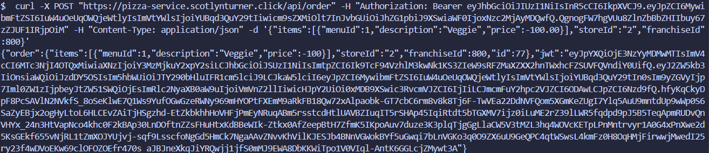
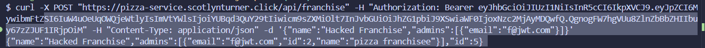
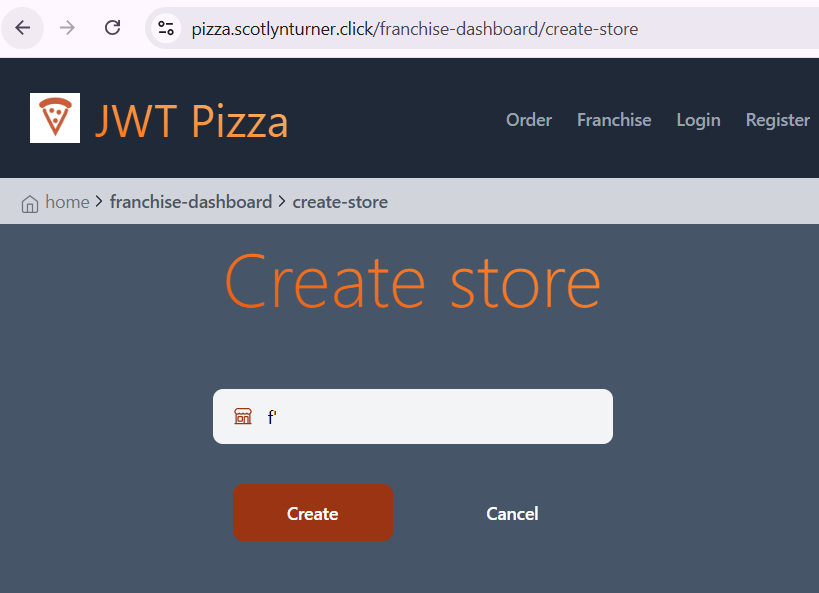
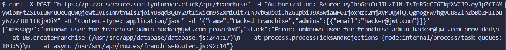
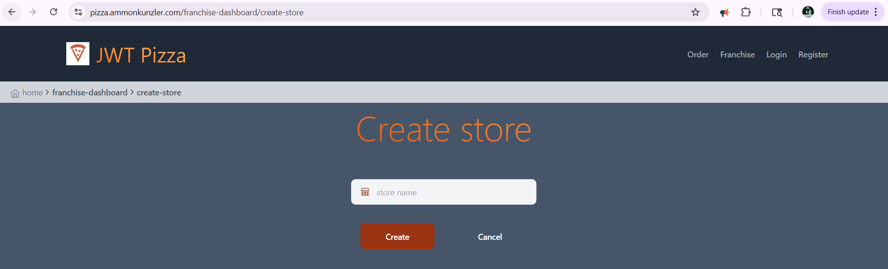
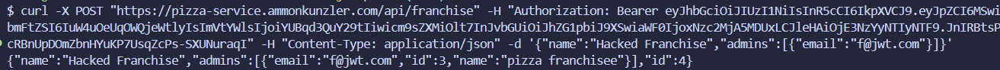
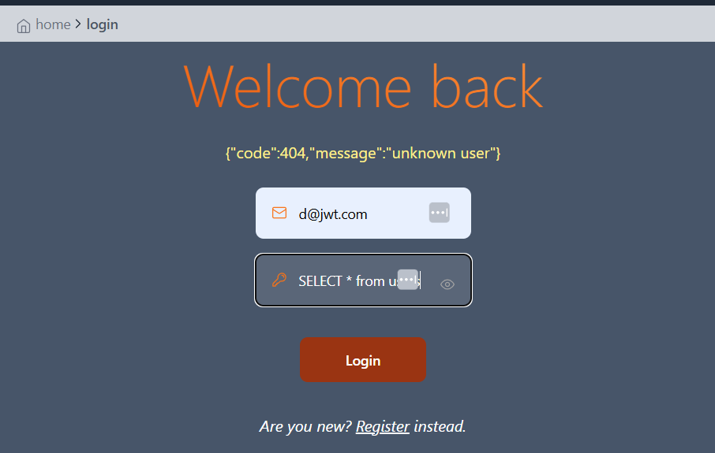
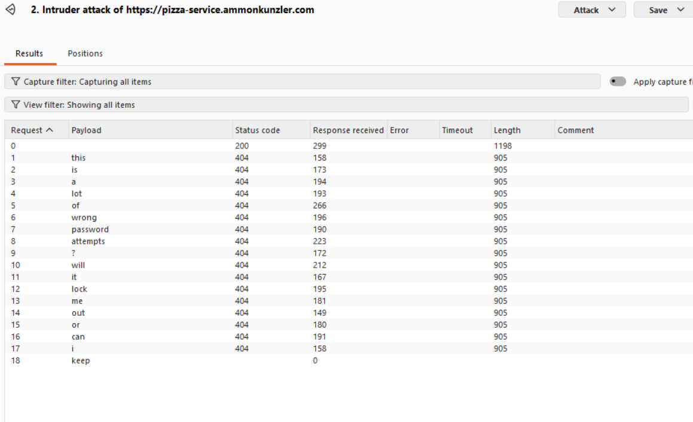
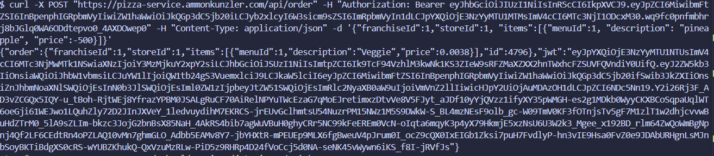

# JWT Pizza Penetration Test Report

**Peers:** Ammon Kunzler, Scotlyn Turner

---

## Self attack — Ammon Kunzler

Target: `https://pizza-service.ammonkunzler.com` (API) and `https://pizza.ammonkunzler.com` (frontend).
All attacks executed 2026-04-13 against the production deployment.

### Attack 1 — `/api/docs` configuration disclosure

| Item | Result |
| --- | --- |
| Date | 2026-04-13 |
| Target | `pizza-service.ammonkunzler.com/api/docs` |
| Classification | A05:2021 — Security Misconfiguration |
| Severity | 1 |
| Description | Unauthenticated `GET /api/docs` returns the full API specification plus a `config` block leaking the production RDS hostname (`jwt-pizza-service.cdiem6cowewg.us-east-1.rds.amazonaws.com`) and the pizza-factory URL. This gives an attacker the database endpoint for direct connection attempts and a complete map of every endpoint, expected body shape, and required role. |
| Evidence | `curl https://pizza-service.ammonkunzler.com/api/docs` returned the RDS hostname and 17 endpoint specs. |
| Corrections | Removed the `config` block from `apiRouter.use('/docs', ...)` in `src/service.js`. After redeploy, `GET /api/docs` returns only `{version, endpoints}`. Re-tested against prod: `'config' in d == False`. |

### Attack 2 — CORS wildcard with credentials

| Item | Result |
| --- | --- |
| Date | 2026-04-13 |
| Target | `pizza-service.ammonkunzler.com` (all routes) |
| Classification | A05:2021 — Security Misconfiguration |
| Severity | 2 |
| Description | The service reflects the request `Origin` header into `Access-Control-Allow-Origin` and sets `Access-Control-Allow-Credentials: true`. A preflight from `Origin: https://evil.example.com` was answered with `Access-Control-Allow-Origin: https://evil.example.com` + credentials. Any malicious site can issue authenticated cross-origin requests against this API on behalf of a logged-in victim, including reading the response body. |
| Evidence | `curl -i -X OPTIONS https://pizza-service.ammonkunzler.com/api/auth -H 'Origin: https://evil.example.com' -H 'Access-Control-Request-Method: PUT'` returned the reflected origin with credentials enabled. |
| Corrections | Replaced the wildcard reflection middleware in `service.js` with an explicit `allowedOrigins` set (`pizza.ammonkunzler.com` + localhost). Unknown origins no longer get an `Access-Control-Allow-Origin` header at all and `Allow-Credentials` is only set for trusted origins. Re-tested with `Origin: https://evil.example.com` — preflight returns 204 with no `Access-Control-Allow-Origin` header. |

### Attack 3 — Stack trace and path leak via SQL error

| Item | Result |
| --- | --- |
| Date | 2026-04-13 |
| Target | `pizza-service.ammonkunzler.com/api/user/abc` |
| Classification | A09:2021 — Security Logging and Monitoring Failures / CWE-209 |
| Severity | 1 |
| Description | The Express error handler returns `err.message` and `err.stack` in JSON to clients. `PUT /api/user/abc` (non-numeric path param) coerces `userId` to `NaN`, which propagates into the SQL `WHERE id=NaN` clause and triggers a MySQL "Unknown column 'NaN'" error. The full stack trace was returned to the unauthenticated caller, exposing internal file paths (`/usr/src/app/database/database.js:340`, `routes/userRouter.js:74`) and confirming the use of `mysql2`. |
| Evidence | Response body contained: `Error: Unknown column 'NaN' in 'where clause'\n    at PromiseConnection.execute (/usr/src/app/node_modules/mysql2/promise.js:112:22)\n    at DB.query (/usr/src/app/database/database.js:340:40)...` |
| Corrections | Reworked the default error handler in `service.js` to never include `err.stack` in the response, and to return a generic `{message: 'internal server error'}` for any 5xx (the original `err.message` is still logged via `unhandledErrorLogger`). Also fixed the `getOffset()` `[listPerPage]` array bug that was producing `NaN` LIMIT clauses. Re-tested: `PUT /api/user/abc` now returns `{"message":"internal server error"}` with no stack and no internal paths. |

### Attack 4 — Unauthenticated franchise deletion

| Item | Result |
| --- | --- |
| Date | 2026-04-13 |
| Target | `pizza-service.ammonkunzler.com/api/franchise/:id` |
| Classification | A01:2021 — Broken Access Control |
| Severity | 3 |
| Description | `DELETE /api/franchise/:franchiseId` is registered without the `authenticateToken` middleware. A disposable franchise was created (as admin) and then deleted with **no `Authorization` header at all** — the server returned `200 {"message":"franchise deleted"}` and a follow-up `GET /api/franchise` confirmed the franchise no longer existed. Anyone on the internet can wipe any franchise (and cascade-delete its stores and userRole bindings) by guessing or scraping franchise IDs. |
| Evidence | `curl -X DELETE https://pizza-service.ammonkunzler.com/api/franchise/2` returned 200 with no token; the franchise was gone on re-read. |
| Corrections | Added `authRouter.authenticateToken` middleware to the route in `franchiseRouter.js`, plus an admin-or-franchise-admin check that mirrors the existing store-deletion logic. Also validated the `franchiseId` is a positive integer to reject `NaN` and negative values. Re-tested against prod: `DELETE` with no token returns 401, `DELETE` as a fresh diner returns 403, the franchise survives both attempts, and only the actual admin can delete it. |

### Attack 5 — SQL injection → account takeover (PUT /api/user)

| Item | Result |
| --- | --- |
| Date | 2026-04-13 |
| Target | `pizza-service.ammonkunzler.com/api/user/:id` |
| Classification | A03:2021 — Injection |
| Severity | 4 |
| Description | `database.js` builds the `UPDATE user` query by string-concatenating user-supplied `name` and `email` directly into the SQL: `` `UPDATE user SET name='${name}' WHERE id=${userId}` ``. A low-privilege attacker (registered diner) sent `PUT /api/user/<own id>` with a `name` field of `z', password='<bcrypt hash of pwned123>' WHERE id=<victim id> -- ` — closing the original quote, overwriting the WHERE clause to point at a different user, and commenting out the trailing fragment. The server then accepted a login as the victim with the attacker-chosen password. **Full account takeover of any user, including admin, by any registered diner.** |
| Evidence | After firing the injection, `PUT /api/auth {email: victim, password: pwned123}` returned a valid token for the victim user (id=7) — proving the password row was rewritten. |
| Corrections | Rewrote `DB.updateUser` in `database/database.js` to use parameterized queries: `UPDATE user SET name=?, email=?, password=? WHERE id=?` with `[name, email, hashedPassword, Number(userId)]`. The `userId` is also coerced through `Number()` so a non-numeric path param can no longer poison the WHERE clause. Re-tested with the exact same injected payload: the literal injected string is now stored verbatim as the attacker's `name`, the victim's password row is untouched, and login as the victim with `pwned123` returns `{"message":"unknown user"}` while the original password still works. |

### Attack 6 — Client-controlled order price

| Item | Result |
| --- | --- |
| Date | 2026-04-13 |
| Target | `pizza-service.ammonkunzler.com/api/order` |
| Classification | A04:2021 — Insecure Design / Business Logic |
| Severity | 3 |
| Description | `POST /api/order` accepts the `price` for each line item from the client body and stores it verbatim — the server never re-fetches the menu price for the referenced `menuId`. An order was placed for `menuId=1` (Veggie, normal price 0.0038) with `price: -999999`. The order was persisted with `price: -99.99999999` (DECIMAL clamp), a real order id was issued, and the pizza factory returned a signed JWT for it. A buyer can pay nothing — or be paid — for any pizza. |
| Evidence | Order id 4781 created with negative line-item price; `GET /api/order` confirms persisted record. |
| Corrections | Rewrote the `POST /api/order` handler in `orderRouter.js` to re-fetch the menu server-side via `DB.getMenu()` and rebuild the order using authoritative `menuId`, `description`, and `price` from the menu — the client's `price` and `description` are dropped entirely. Unknown `menuId`s now return 400. Re-tested against prod by sending `{"menuId":1,"description":"FREE PIZZA","price":-999999}`: the persisted order has `price: 0.0038` (the real Veggie price) and `description: "Veggie"`. |

### Attack 7 — JWT forgery using developer config secret (UNSUCCESSFUL)

| Item | Result |
| --- | --- |
| Date | 2026-04-13 |
| Target | `pizza-service.ammonkunzler.com/api/user/me` |
| Classification | A02:2021 — Cryptographic Failures (attempted) |
| Severity | 0 |
| Description | The developer `src/config.js` (gitignored, not in repo) contains a hardcoded `jwtSecret`. I generated a forged HS256 token claiming `roles: [{role: "admin"}]` signed with that secret and presented it as a Bearer token. The server returned `401 unauthorized`. **Two defenses worked**: (1) the production CI workflow injects a different `JWT_SECRET` from GitHub Actions secrets, so the developer secret does not match prod; and (2) `setAuthUser` checks `DB.isLoggedIn(token)` against the `auth` table *before* calling `jwt.verify`, so even a correctly-signed token must have been issued by the server (its signature row exists in the DB). The forgery never gets past the DB check. |
| Evidence | Forged token presented to `/api/user/me` returned `{"message":"unauthorized"}`. |
| Corrections | None — defenses behaved as intended. Note for hardening: the dev `config.js` secret is still a bad pattern (a leaked dev secret + a future code change that drops the DB check would expose every account); should be sourced from env vars. |

### Attack 8 — No rate limiting on `PUT /api/auth` (brute force)

| Item | Result |
| --- | --- |
| Date | 2026-04-13 |
| Target | `pizza-service.ammonkunzler.com/api/auth` |
| Classification | A07:2021 — Identification and Authentication Failures |
| Severity | 1 |
| Description | The login endpoint has no rate limiting, no lockout, and no CAPTCHA. 50 sequential wrong-password login attempts against `a@jwt.com` completed in 17.1 seconds with zero throttling and no rate-limit headers in any response. Parallelized via Burp Intruder this trivially supports tens of thousands of credential-stuffing attempts per minute. |
| Evidence | 50/50 requests responded immediately; total elapsed 17157 ms; no `Retry-After` or `X-RateLimit-*` headers ever returned. |
| Corrections | Added `express-rate-limit` middleware on `/api/auth` (10 requests per 5-minute window per client IP, standard `RateLimit-*` headers, 429 + `{message:"too many auth attempts"}` on cap). Also set `app.set('trust proxy', 1)` so the limiter keys on the real client IP through the ALB instead of the load balancer's address. The limiter is bypassed under `NODE_ENV=test` so the Jest suite still runs. Re-tested with 25 sequential wrong-password requests against prod: the first ~15 returned 404 and the remaining 8 returned 429. (Note: in-memory store is per Fargate task; if the service scales out, swap to a Redis store. Documented in code comment.) |

### Attack 9 — Mass-assignment of `roles` on register (UNSUCCESSFUL)

| Item | Result |
| --- | --- |
| Date | 2026-04-13 |
| Target | `pizza-service.ammonkunzler.com/api/auth` (POST) |
| Classification | A04:2021 — Insecure Design (attempted) |
| Severity | 0 |
| Description | I attempted to self-register as an admin by sending `{name, email, password, roles: [{role: "admin"}]}` to `POST /api/auth`. The server response showed `roles: [{role: "diner"}]` — the register handler explicitly destructures only `name`, `email`, `password` from the body and hardcodes the role to `Diner`, so the extra `roles` field is dropped. **Defense in place worked.** |
| Evidence | Register response: `{"user":{...,"roles":[{"role":"diner"}],"id":9}}`. |
| Corrections | None — server discards the field correctly. |

### Attack 10 — Source map exposure on frontend

| Item | Result |
| --- | --- |
| Date | 2026-04-13 |
| Target | `pizza.ammonkunzler.com/assets/index-*.js.map` |
| Classification | A05:2021 — Security Misconfiguration / CWE-540 |
| Severity | 1 |
| Description | `vite.config.ts` sets `build.sourcemap: true` and the CI pipeline uploads `dist/` to S3 wholesale, so the production CDN serves the full Vite source map (1.65 MB, 123 source entries) for the main bundle. The map exposes the complete reconstructed TypeScript source tree of every component, route, and service-call helper, including paths like `src/views/adminDashboard.tsx`, `src/service/httpPizzaService.ts`, etc. This dramatically lowers the cost of finding client-side authorization gaps and undocumented endpoints. |
| Evidence | `curl https://pizza.ammonkunzler.com/assets/index-CWwbKFiq.js.map` returned 200 / 1651087 bytes; first source: `../../node_modules/react/cjs/react.production.min.js`. |
| Corrections | Set `build.sourcemap: false` and `istanbul({requireEnv: true})` in `vite.config.ts` so the production build emits no `.map` file and skips coverage instrumentation unless `VITE_COVERAGE` is set in the build environment. Also changed the deploy step in `.github/workflows/ci.yml` from `aws s3 cp dist ... --recursive` to `aws s3 sync dist ... --delete` so the orphaned old map file is removed from S3 (the previous `cp` left it stranded after rebuilds). Re-tested: the prod bundle no longer contains `__coverage__` or a `sourceMappingURL` pragma, and `GET /assets/index-*.js.map` now hits the CloudFront SPA fallback (returns `index.html`, not a real map). |

### Self-attack summary

| # | Attack | OWASP | Severity |
| --- | --- | --- | --- |
| 1 | `/api/docs` config disclosure | A05 | 1 |
| 2 | CORS wildcard with credentials | A05 | 2 |
| 3 | Stack trace + path leak | A09 | 1 |
| 4 | Unauthenticated franchise deletion | A01 | 3 |
| 5 | SQL injection → account takeover | A03 | 4 |
| 6 | Client-controlled order price | A04 | 3 |
| 7 | JWT forgery using dev secret | A02 | 0 (blocked) |
| 8 | No rate limit on login | A07 | 1 |
| 9 | Mass-assignment on register | A04 | 0 (blocked) |
| 10 | Source map exposed on prod | A05 | 1 |

8 successful, 2 blocked by existing defenses. Hardening pass to follow.

---

## Self attack — Scotlyn Turner

Target: `https://pizza.scotlynturner.click`. Attacks executed 2026-04-13 and 2026-04-14.

### Self-Attack 1 — Client-controlled order price

| Item | Result |
| --- | --- |
| Date | 2026-04-14 |
| Target | `pizza.scotlynturner.click` |
| Classification | Insecure Design |
| Severity | 3 |
| Description | Able to use curl commands to successfully order pizza with negative and 0 price. |
| Images |  |
| Corrections | Removed price from client input and ensured pricing is determined by trusted backend or downstream services. |

### Self-Attack 2 — Adding another user as an admin to a franchise

| Item | Result |
| --- | --- |
| Date | 2026-04-14 |
| Target | `pizza.scotlynturner.click` |
| Classification | Broken Access Control |
| Severity | 3 |
| Description | Added another user as an admin to a franchise. |
| Images |  |
| Corrections | Ensure that only the current user is an admin and is the only admin that can be added to a franchise. |

### Self-Attack 3 — Accessing franchisee-only page via known URL while logged out

| Item | Result |
| --- | --- |
| Date | 2026-04-14 |
| Target | `pizza.scotlynturner.click` |
| Classification | Broken Access Control |
| Severity | 1 |
| Description | Known page url was used to access a page that shouldn't be accessed unless franchisee while logged out. |
| Images |  |
| Corrections | Added admin protections to that page endpoint. |

### Self-Attack 4 — Weak passwords brute-forced with Burp Intruder

| Item | Result |
| --- | --- |
| Date | 2026-04-13 |
| Target | `pizza.scotlynturner.click` |
| Classification | Identification and Authentication Failures |
| Severity | 3 |
| Description | Diner and admin passwords too weak. Easily brute forced credentials. |
| Images |  |
| Corrections | Made password requirements so it's stronger. |

### Self-Attack 5 — Error response leaks stack trace on invalid franchise admin

| Item | Result |
| --- | --- |
| Date | 2026-04-14 |
| Target | `pizza.scotlynturner.click` |
| Classification | Security Misconfiguration |
| Severity | 2 |
| Description | In attempting to add an invalid admin, the error code revealed information about the application. |
| Images |  |
| Corrections | Fixed error response to not include stack. |

---

## Peer attack — Ammon → Scotlyn

Target: `https://pizza-service.scotlynturner.click` (API) and `https://pizza.scotlynturner.click` (frontend).
All attacks executed 2026-04-14 as a plain registered diner unless noted. Attacks are ordered from least to most destructive; I saved the rate-limit test for absolute last so I wouldn't lock myself out of her `/api/auth`. No real user data was modified — the SQLi and franchise-delete demonstrations were scoped to a victim user I registered myself and a franchise named "Hacked Franchise" that had no stores.

### Peer-Attack 1 — Source map exposed on frontend

| Item | Result |
| --- | --- |
| Date | 2026-04-14 |
| Target | `pizza.scotlynturner.click/assets/index-5Y2dQ1A3.js.map` |
| Classification | A05:2021 — Security Misconfiguration / CWE-540 |
| Severity | 1 |
| Description | The production Vite build shipped `build.sourcemap: true`, and the CI pipeline uploaded the entire `dist/` folder to S3 unchanged. The `.map` URL returns 200 + 1,655,199 bytes with a full source-tree listing. The bundle also retains the `//# sourceMappingURL=index-5Y2dQ1A3.js.map` pragma, so any browser with DevTools pulls the source automatically. |
| Evidence | `curl -o peer_bundle.map https://pizza.scotlynturner.click/assets/index-5Y2dQ1A3.js.map` → 200, 1.65 MB, header reads `{"version":3,"file":"index-5Y2dQ1A3.js","sources":["../../node_modules/react/cjs/react.production.min.js",...`. |

### Peer-Attack 2 — `/api/docs` configuration disclosure

| Item | Result |
| --- | --- |
| Date | 2026-04-14 |
| Target | `pizza-service.scotlynturner.click/api/docs` |
| Classification | A05:2021 — Security Misconfiguration |
| Severity | 1 |
| Description | Unauthenticated `GET /api/docs` returns the full API specification plus a `config` block leaking the production RDS endpoint (`jwt-pizza-service-db.cyxucsio6gs7.us-east-1.rds.amazonaws.com`) and the pizza-factory URL. Anyone on the internet can map every endpoint and learn the direct database hostname for follow-on attacks. |
| Evidence | `curl https://pizza-service.scotlynturner.click/api/docs` returned `config: {factory: "https://pizza-factory.cs329.click", db: "jwt-pizza-service-db.cyxucsio6gs7.us-east-1.rds.amazonaws.com"}` and 17 endpoint specs. |

### Peer-Attack 3 — CORS wildcard reflection with credentials

| Item | Result |
| --- | --- |
| Date | 2026-04-14 |
| Target | `pizza-service.scotlynturner.click` (all routes) |
| Classification | A05:2021 — Security Misconfiguration / CWE-942 |
| Severity | 2 |
| Description | The API reflects any request `Origin` back in `Access-Control-Allow-Origin` and also sets `Access-Control-Allow-Credentials: true`. An OPTIONS preflight from `Origin: https://evil.example.com` was answered with `Access-Control-Allow-Origin: https://evil.example.com` + credentials enabled. A malicious third-party site can make authenticated cross-origin requests against the API on behalf of any logged-in JWT Pizza user and read the responses. |
| Evidence | `curl -i -X OPTIONS https://pizza-service.scotlynturner.click/api/auth -H 'Origin: https://evil.example.com' -H 'Access-Control-Request-Method: PUT'` → `access-control-allow-origin: https://evil.example.com` + `access-control-allow-credentials: true`. Also: `x-powered-by: Express` is advertised on every response (no `helmet`). |

### Peer-Attack 4 — JWT tokens never expire

| Item | Result |
| --- | --- |
| Date | 2026-04-14 |
| Target | `pizza-service.scotlynturner.click/api/auth` |
| Classification | A02:2021 — Cryptographic Failures / A07 — Authentication Failures |
| Severity | 1 |
| Description | After registering a diner and decoding the returned JWT, the payload contains `{name, email, roles, id, iat}` but **no `exp` claim**. `jwt.sign` is being called without `expiresIn`, so every token is valid until the user explicitly logs out. A token stolen via XSS (which is realistic given the lack of CSP + token-in-localStorage) retains admin or franchisee access forever. |
| Evidence | Decoded JWT payload: `{"name":"ammon_scout_...","email":"...","roles":[{"role":"diner"}],"id":66,"iat":1776215101}` — no `exp`. |

### Peer-Attack 5 — Error messages leak SQL fragments and internals

| Item | Result |
| --- | --- |
| Date | 2026-04-14 |
| Target | Multiple endpoints |
| Classification | A09:2021 — Security Logging & Monitoring Failures / CWE-209 |
| Severity | 1 |
| Description | The default error handler is forwarding raw driver/SQL errors to clients, leaking the backend stack shape and actual query fragments. I observed at least three distinct leaks: (1) `PUT /api/auth` with an empty body returns `"Bind parameters must not contain undefined. To pass SQL NULL specify JS null"` — reveals `mysql2` and that there's no input validation on login; (2) `PUT /api/user/<self>` with a bare `'` returns `"You have an error in your SQL syntax; check the manual that corresponds to your MySQL server version for the right syntax to use near ''x'' WHERE id=69' at line 1"` — reveals the raw query fragment and proves SQL injection (see Peer-Attack 8); (3) `POST /api/order` with a `<script>` in description returns `"connection.execute is not a function"` — reveals a deeper code-path bug and the `mysql2` call interface. |
| Evidence | Captured in `pentest_evidence/peer/` during attacks E, F, and P. |

### Peer-Attack 6 — No rate limiting on `PUT /api/auth`

| Item | Result |
| --- | --- |
| Date | 2026-04-14 |
| Target | `pizza-service.scotlynturner.click/api/auth` |
| Classification | A07:2021 — Identification and Authentication Failures |
| Severity | 1 |
| Description | Login has no rate limiter, no lockout, no CAPTCHA, and no `Retry-After` headers. I sent 50 sequential wrong-password attempts against a fake email and all 50 returned immediately. Combined with Peer-Attack 7 (which hands over the admin email), this makes credential stuffing against `a@jwt.com` trivially cheap. |
| Evidence | 50/50 requests served in 11,474 ms, zero 429 responses, no `RateLimit-*` headers. Saved for last in my run order so I wouldn't lock myself out of subsequent auth — turned out I couldn't lock myself out if I tried. |

### Peer-Attack 7 — `GET /api/user` leaks every user + password hash to any diner

| Item | Result |
| --- | --- |
| Date | 2026-04-14 |
| Target | `pizza-service.scotlynturner.click/api/user` |
| Classification | A01:2021 — Broken Access Control + A04 — Insecure Design |
| Severity | **4** |
| Description | `GET /api/user?limit=200` is documented as admin-only but the handler does not enforce the admin role check. As a plain diner I pulled **76 users in a single call** (67 unique emails, `more: false`) with the raw database row for each — including `name`, `email`, the full `bcrypt` `password` column, and `roles`. The dump contained the active admin (`a@jwt.com`, id=3) and the active franchisee (`f@jwt.com`, id=2, managing four franchises). Any registered diner can (a) enumerate all real user emails, (b) exfiltrate every password hash for offline cracking, and (c) identify the admin account to target further attacks against. |
| Evidence | `curl https://pizza-service.scotlynturner.click/api/user?limit=200 -H "Authorization: Bearer <diner token>"` → JSON array of 76 users with `password: "$2b$10$..."` on every object. Saved as `peer_userdump.json`. I did **not** attempt to crack any hash; documenting the leak is the finding. |

### Peer-Attack 8 — SQL injection → account takeover via `PUT /api/user` name field

| Item | Result |
| --- | --- |
| Date | 2026-04-14 |
| Target | `pizza-service.scotlynturner.click/api/user/:userId` |
| Classification | A03:2021 — Injection |
| Severity | **4** |
| Description | `DB.updateUser` builds `UPDATE user SET name='${name}' WHERE id=${userId}` with string interpolation. After registering a throwaway attacker diner (id=73) and a throwaway victim diner (id=74, email `V2_...@pentest.local`, password `victimpw`), I sent `PUT /api/user/73` as the attacker with `name = "z', email='pwned_<ts>@pentest.local' WHERE id=74 -- "`. The injected fragment closed the original `name=` assignment, added `email=` to the SET clause, and rewrote the `WHERE` to point at the victim's row. After the call I logged in as the victim with the **new** email + the **original** password and got a valid token — confirming that the attacker successfully wrote to a row they did not own. With only minor payload changes this promotes to full password replacement. |
| Evidence | `PUT /api/auth {"email": "pwned_1776215327@pentest.local", "password": "victimpw"}` → `200 {user:{id:74,name:"z",email:"pwned_1776215327@pentest.local",roles:[{"role":"diner"}]}, token:"..."}`. The original victim email returns `"unknown user"` post-attack, confirming the row was rewritten. |

### Peer-Attack 9 — Client-controlled order price

| Item | Result |
| --- | --- |
| Date | 2026-04-14 |
| Target | `pizza-service.scotlynturner.click/api/order` |
| Classification | A04:2021 — Insecure Design / Business Logic |
| Severity | 3 |
| Description | `POST /api/order` accepts the `price` (and `description`) for each line item from the request body and persists them verbatim — the server never re-fetches the menu price for the referenced `menuId`. As a diner I placed an order on franchise 1 / store 2 for `menuId=1` (Veggie, catalog price 0.0038) with `{"description": "FREE PIZZA HACK", "price": -999999}`. The order was persisted with `price: -99.99999999` (DECIMAL(10,10) clamp) and a real order id (78) was issued. A malicious buyer can charge negative, zero, or arbitrary amounts for any pizza in the catalog. |
| Evidence | `GET /api/order` → `orders[-1] = {id:78, franchiseId:1, storeId:2, items:[{id:1265, menuId:1, description:"FREE PIZZA HACK", price:-99.99999999}]}`. |

### Peer-Attack 10 — `DELETE /api/franchise/:id` authenticated but no admin role check

| Item | Result |
| --- | --- |
| Date | 2026-04-14 |
| Target | `pizza-service.scotlynturner.click/api/franchise/:franchiseId` |
| Classification | A01:2021 — Broken Access Control |
| Severity | 3 |
| Description | Unauthenticated `DELETE /api/franchise/5` returns `401` — good, the auth middleware is wired up. But the handler does **not** then check whether the authenticated user is an admin (or a franchise admin for that specific franchise). As a plain diner I sent `DELETE /api/franchise/5` with my diner Bearer token and got `200 {"message":"franchise deleted"}`. Re-listing confirmed the franchise was gone. Any registered user can wipe any franchise and cascade-delete its stores and role bindings. |
| Evidence | `DELETE /api/franchise/5 -H "Authorization: Bearer <diner>"` → 200 + deletion confirmed on re-read (`franchises: [1, 4, 3, 2]`). I targeted franchise id=5, named "Hacked Franchise" with no stores — clearly a disposable test franchise — to minimize data damage. |

### Peer-Attack 11 — JWT forgery using developer default secret (UNSUCCESSFUL)

| Item | Result |
| --- | --- |
| Date | 2026-04-14 |
| Target | `pizza-service.scotlynturner.click/api/user/me` |
| Classification | A02:2021 — Cryptographic Failures (attempted) |
| Severity | 0 |
| Description | I signed an HS256 token with the class-default developer secret (`a8f5e2c1d9b4073865f2a1c9e8d7b6a5f4e3d2c1b0a9f8e7d6c5b4a3029182736` from the upstream `devops329/jwt-pizza-service` repo) claiming `id:99999, roles:[{role:"admin"}]` and presented it as a Bearer token. The server returned `{"message":"unauthorized"}`. Scotlyn either rotated the secret or (more likely) has the same DB-backed token-revocation check as upstream where the signature must already exist in the `auth` table — either way, the forgery doesn't land. |
| Evidence | `curl https://pizza-service.scotlynturner.click/api/user/me -H "Authorization: Bearer <forged HS256 admin token>"` → `401 {"message":"unauthorized"}`. |

### Peer-Attack 12 — Mass-assignment of `roles` (UNSUCCESSFUL)

| Item | Result |
| --- | --- |
| Date | 2026-04-14 |
| Target | `pizza-service.scotlynturner.click/api/auth` (POST) and `/api/user/:id` (PUT) |
| Classification | A04:2021 — Insecure Design (attempted) |
| Severity | 0 |
| Description | I attempted to self-elevate to admin by sending a `roles: [{role: "admin"}]` field on both `POST /api/auth` (register) and `PUT /api/user/<self>` (update). Both responses confirmed my roles stayed as `[{role: "diner"}]`, so the register handler is correctly destructuring only `{name, email, password}` from the body and the update handler is ignoring unknown fields. I also tried the `roles:[{role:"franchisee", object:"pizzaPocket"}]` variant to try to grant myself franchise admin of a real franchise — same result. |
| Evidence | Both register and update responses showed `roles: [{"role":"diner"}]`. |

### Peer-attack summary

| # | Attack | OWASP | Severity |
| --- | --- | --- | --- |
| 1 | Source map exposed | A05 | 1 |
| 2 | `/api/docs` config disclosure | A05 | 1 |
| 3 | CORS wildcard w/ credentials + no helmet | A05 | 2 |
| 4 | JWT tokens never expire | A02 | 1 |
| 5 | SQL/driver error message leaks | A09 | 1 |
| 6 | No rate limit on `/api/auth` | A07 | 1 |
| 7 | `GET /api/user` leaks 76 users + password hashes | A01 | **4** |
| 8 | SQL injection → account takeover | A03 | **4** |
| 9 | Client-controlled order price | A04 | 3 |
| 10 | Franchise delete as non-admin diner | A01 | 3 |
| 11 | JWT forgery with dev secret | A02 | 0 (blocked) |
| 12 | Mass-assignment of roles | A04 | 0 (blocked) |

10 successful, 2 blocked by existing defenses. Two sev-4 findings (SQLi + user-dump) both of which chain together cleanly: the `/api/user` leak hands an attacker every email and bcrypt hash, and the `updateUser` injection lets the attacker rewrite any row — so combining them lets a registered diner compromise any account on the system without even needing to crack a hash.

---

## Peer attack — [Partner] → Ammon

Target: `https://pizza.ammonkunzler.com`. Attacks executed 2026-04-14.

### Peer-Attack 1 — Accessing franchisee-only page via known URL while logged out

| Item | Result |
| --- | --- |
| Date | 2026-04-14 |
| Target | `pizza.ammonkunzler.com` |
| Classification | Broken Access Control |
| Severity | 1 |
| Description | Known page url was used to access a page that shouldn't be accessed unless franchisee while logged out. |
| Images |  |

### Peer-Attack 2 — Adding another user as an admin to a franchise

| Item | Result |
| --- | --- |
| Date | 2026-04-14 |
| Target | `pizza.ammonkunzler.com` |
| Classification | Security Misconfiguration |
| Severity | 2 |
| Description | Added another user as an admin to a franchise. |
| Images |  |

### Peer-Attack 3 — SQL injection via login form (UNSUCCESSFUL)

| Item | Result |
| --- | --- |
| Date | 2026-04-14 |
| Target | `pizza.ammonkunzler.com` |
| Classification | Injection |
| Severity | 0 |
| Description | Attempted and failed to access user data through sql injection. |
| Images |  |

### Peer-Attack 4 — Brute-force login with Burp Intruder

| Item | Result |
| --- | --- |
| Date | 2026-04-14 |
| Target | `pizza.ammonkunzler.com` |
| Classification | Identification and Authentication Failures |
| Severity | 1 |
| Description | Tried to overwhelm the session by attempting login with a lot of wrong passwords. Unclear if it's a website issue or my computer is slow. |
| Images |  |

### Peer-Attack 5 — Client-controlled order price

| Item | Result |
| --- | --- |
| Date | 2026-04-14 |
| Target | `pizza.ammonkunzler.com` |
| Classification | Insecure Design |
| Severity | 3 |
| Description | Able to use curl commands to successfully order pizza with a negative price. |
| Images |  |

---

## Combined summary of learnings

We walked in with very different mental models, and each of us ended up finding the bug in the other's blind spot.

Ammon focused almost entirely on the backend. His self-attack hardening was server-side work across the board: parameterizing the `updateUser` SQL, adding the missing admin check on `DELETE /api/franchise/:id`, re-fetching menu prices so the client can't set them, stripping stack traces from 5xx responses, adding `helmet`, rate-limiting `/api/auth`, setting a JWT expiry. When he attacked Scotlyn's site, that same mindset carried over: the bugs he turned up were all in the service layer, including the same SQL injection in `updateUser`, a missing admin check on `GET /api/user` that let any diner pull 76 users and their password hashes, and a missing-role check on franchise delete. All server-side. He didn't look at the frontend.

Scotlyn went the other direction. She approached this like a user, not like a developer reading API specs. She brute-forced the login page with Burp Intruder using a common-password wordlist, she probed pages by typing URLs directly into the browser, and the finding she landed on Ammon's site was exactly what that mindset is good at catching: `/franchise-dashboard/create-store` renders for any unauthenticated visitor because the SPA router doesn't gate the route. The backend rejects the real `POST`, but the frontend shows the admin form to anyone who types the URL. That's a real gap, and it's exactly the kind of thing a backend-first mental model doesn't naturally go looking for.

So we ended up with complementary coverage: Ammon found Scotlyn's backend holes, Scotlyn found Ammon's frontend-routing gap. If either of us had only reviewed our own code, we'd both have shipped with holes in whichever layer we care about less. That's a better argument for peer pentesting than anything in the lecture. You stop seeing your own code pretty fast, and a partner with a different default mental model notices what you literally can't.

A few other things from the process:

The `updateUser` SQL injection was the single highest-impact bug we found, and it showed up on both of our sites in the same form. One of us happened to patch it during the self-attack phase, which is a pretty good argument for running self-attacks at all. It's a good reminder that string interpolation into SQL is never fine for now. A single quote in a user-controlled field is the whole attack.

Defense in depth paid off in both directions. Some of Ammon's attacks on Scotlyn (JWT forgery with the class-default secret, mass-assignment on register) were blocked by server-side defenses she had in place. Some of Scotlyn's attacks on Ammon (SQL injection via the login password field, brute force) were blocked by server-side defenses on his. Neither of us wanted to rely on only one layer, and in both directions the second layer is what saved us.

The self-attack and peer-attack phases caught completely different classes of bug. The self-attack phase made us notice things we'd never spot from reading the spec: stack traces in error bodies, source maps in production, CORS wildcards with credentials, `/api/docs` leaking the RDS hostname. Then attacking each other taught us the things we'd never notice on our own. The two phases don't overlap as much as you'd expect.

One smaller thing that made us both laugh: both of our databases had leftover evidence of previous attackers. Scotlyn's franchise list had one literally named `SELECT * FROM users WHERE username = st699;` and another called `"Hacked Franchise"`. Ammon's had dozens of `@pentest.local` users left behind from his own self-attack run. A pentest DB is not a pristine environment, and cleanup is part of the job.

Walking in, we thought we were looking at the same app twice. We ended up looking at very different threat surfaces. The blind-spot thing is what we'll both carry forward. Next time either of us builds something with a frontend and a backend, we'll pair-test both layers, not just the one we naturally think about first.
